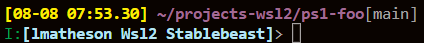

# ps1-foo

Provides smart `PS1` bash shell setting:

 </img>

- Date/time
- Current dir (collapses long paths)
- Git branch (if `parse_git_branch` exists)
- Username
- Platform category (e.g. `Wsl2`)
- Machine name

## Setup:

Download and install the self-extracting setup script:
```
curl -L https://github.com/sanekits/ps1-foo/releases/download/1.0.3/ps1-foo-setup-1.0.3.sh \
    -o ~/tmp$$.sh && bash ~/tmp$$.sh && rm ~/tmp$$.sh
```

Or **if** [shellkit-pm](https://github.com/sanekits/shellkit-pm) is installed:

    shpm install ps1-foo

##
